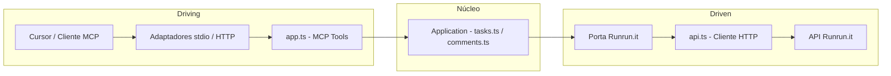

# MCP Runrun.it

Servidor MCP (Model Context Protocol) para comunicação com a API do [Runrun.it](https://runrun.it). Expõe ferramentas de **Tasks** e **Comments** para uso no Cursor ou em outros clientes MCP.

**Versão atual:** 1.9.0 — ver [CHANGELOG.md](CHANGELOG.md).

## Arquitetura

O projeto adota o padrão **Arquitetura Hexagonal** (Ports & Adapters): o núcleo da aplicação fica isolado de detalhes de transporte (stdio, HTTP) e do cliente HTTP do Runrun.it. As **portas** definem contratos de entrada (MCP) e saída (acesso à API); os **adaptadores** implementam esses contratos (transporte e cliente HTTP).

### Mapeamento no projeto

- **Núcleo / aplicação:** regras e orquestração dos casos de uso (Tasks e Comments). Arquivos: `src/application/tasks.ts`, `src/application/comments.ts`; em uma evolução podem depender apenas de uma abstração de "cliente Runrun.it" (porta de saída).
- **Porta de entrada (driving):** protocolo MCP (ListTools, CallTool). Implementada em `src/adapters/driving/app.ts` (registro de tools e handler que delega para a aplicação).
- **Adaptadores de entrada:** como o MCP é acessado — `src/index.ts` (stdio) e `src/server.ts` (HTTP). Ambos usam o mesmo `createMcpServer()`.
- **Porta de saída (driven):** contrato para acessar o Runrun.it (listar/criar tarefas, comentários, etc.). Hoje usada implicitamente; em uma evolução pode ser uma interface TypeScript injetada.
- **Adaptador de saída:** implementação HTTP da API Runrun.it em `src/adapters/driven/api.ts` (auth, `runrunitFetch`, tratamento de erros).
- **Workflow GitHub:** casos de uso em `src/application/github-workflow/` dependem da porta `GitWorkspacePort` (`src/domain/github-workflow.ts`). O adaptador `src/adapters/driven/git-workspace.ts` executa `git` e `gh`. As tools em `src/adapters/driving/` só fazem parse e delegam. Escrita (`checkout`, `commit`, `push`, `gh pr create`) só ocorre com `approved: true`; o padrão é um plano.

### Fluxo



### Estrutura de pastas

| Pasta / Arquivos                | Papel                                                                                |
| ------------------------------- | ------------------------------------------------------------------------------------ |
| `src/index.ts`, `src/server.ts` | Pontos de entrada (adaptadores de transporte stdio e HTTP)                           |
| `src/domain/`                   | Domínio: tipos e portas (`GitWorkspacePort` em `github-workflow.ts`)                 |
| `src/application/`              | Núcleo de aplicação: tasks, comments e `github-workflow/` (um caso de uso por skill) |
| `src/adapters/driving/`         | Adaptador de entrada: `app.ts` e `github-workflow-tools.ts` (tools MCP)              |
| `src/adapters/driven/`          | Adaptadores de saída: `api.ts` (HTTP Runrun.it) e `git-workspace.ts` (`git`/`gh`)    |

A separação permite trocar o transporte (stdio vs HTTP) sem alterar o núcleo e, no futuro, mockar ou trocar a implementação da API Runrun.it para testes ou outros backends.

## Autenticação

A API do Runrun.it exige dois headers em toda requisição:

- **App-Key**: identifica a conta (obtido em Integração e Apps → API e Webhooks)
- **User-Token**: token do usuário em nome do qual as ações são executadas

Configure as variáveis de ambiente (ou no JSON de configuração do MCP no Cursor):

- `RUNRUNIT_APP_KEY` — chave da aplicação
- `RUNRUNIT_USER_TOKEN` — token do usuário

**GitHub** (opcional; tools `runrunit_share_cursor_agent` e `runrunit_share_cursor_skill`):

- `GITHUB_TOKEN` — PAT ou token com permissão de escrita em `contents` e `pull_requests` no repositório alvo
- `GITHUB_REPO_OWNER`, `GITHUB_REPO_NAME` — repositório onde abrir o PR (opcional se `project_root` for um repo git com `origin` no GitHub; detectados automaticamente)
- `GITHUB_BASE_BRANCH` — branch base (opcional; detectada via `git symbolic-ref refs/remotes/origin/HEAD`, senão `main`)

Prioridade: variáveis de ambiente **>** detecção git no `project_root` **>** default `main`.

Exemplo mínimo no MCP host (só credenciais; repositório e branch base vêm do `origin` do projeto em que o agente trabalha):

```json
{
  "env": {
    "GITHUB_TOKEN": "ghp_...",
    "BITBUCKET_USERNAME": "user@example.com",
    "BITBUCKET_APP_PASSWORD": "..."
  }
}
```

**Bitbucket** (opcional; tools `runrunit_share_cursor_agent_bitbucket` e `runrunit_share_cursor_skill_bitbucket`):

- `BITBUCKET_USERNAME`, `BITBUCKET_APP_PASSWORD` — credenciais (obrigatórias no host MCP)
- `BITBUCKET_WORKSPACE`, `BITBUCKET_REPO_SLUG` — repositório alvo (opcional se `project_root` tiver `origin` no Bitbucket)
- `BITBUCKET_BASE_BRANCH` — branch base (opcional; mesma detecção git que GitHub)

Estas variáveis existem **só no anfitrião do processo MCP** (ficheiro de config do Cursor, CI, segredos da org). **Não** passe token nem credenciais como argumento de tool nem partilhe em chat ou repositório.

**Sentry** (opcional; monitoramento de erros do MCP):

- `SENTRY_DSN` — DSN do projeto Sentry
- `SENTRY_ENVIRONMENT` — ambiente (`development`, `staging`, `production`)
- `SENTRY_RELEASE` — versão/release (ex.: `mcp-runrunit@1.8.1+abc1234`)
- `SENTRY_ENABLED` — liga/desliga o envio de eventos
- `SENTRY_ERROR_SAMPLE_RATE` — taxa de amostragem de erros (0.0 a 1.0; default 1.0)

Recomendação: manter `sendDefaultPii` desabilitado (já aplicado no código) e configurar segredos apenas no ambiente do host MCP/CI.
Guia operacional de validação/rollout: `docs/SENTRY-ROLLOUT.md`.

## Instalação e utilização local

```bash
cd mcp-runrunit
npm install
npm run build
```

## Uso no Cursor

1. Abra as configurações do Cursor (MCP).
2. Adicione o servidor no arquivo de configuração de MCP (por exemplo em `.cursor/mcp.json` ou nas configurações do Cursor).

Exemplo de configuração (ajuste o caminho para o seu projeto):

```json
{
  "mcpServers": {
    "runrunit": {
      "command": "node",
      // Use o caminho absoluto para `dist/index.js` no seu ambiente.
      "args": ["caminho-do-repositório-local/mcp-runrunit/dist/index.js"],
      "env": {
        "RUNRUNIT_APP_KEY": "sua_app_key",
        "RUNRUNIT_USER_TOKEN": "seu_user_token"
      }
    }
  }
}

// ou

"runrunit-mcp": {
      "url": "http://localhost:3000/mcp",
      "env": {
        // Nesse modo é importante criar o arquivo .env na raiz do mcp ./plugin-sentinel-mcp/mcp-runrunit
      }
    },
```

### Uso via npm (para outras pessoas)

Depois de publicado no npm, qualquer pessoa pode usar com `npx` sem clonar o repositório:

```json
{
  "mcpServers": {
    "runrunit": {
      "command": "npx",
      "args": ["-y", "mcp-runrunit"],
      "env": {
        "RUNRUNIT_APP_KEY": "<RUNRUNIT_APP_KEY>",
        "RUNRUNIT_USER_TOKEN": "<RUNRUNIT_USER_TOKEN>",
        "BOT_DISCORD_TOKEN_PUBLIC_ID": "<BOT_DISCORD_TOKEN_PUBLIC_ID>",
        "BOT_RUNRUNIT_REPORT_PRIVATE_KEY": "<BOT_RUNRUNIT_REPORT_PRIVATE_KEY>",
        "DISCORD_GUILD_ID": "<DISCORD_GUILD_ID>",
        "DISCORD_CHANNEL_ID": "<DISCORD_CHANNEL_ID>"
      }
    }
  }
}
```

## Cursor Skills e agentes (evidências, PR, comentários na task, agents)

O pacote inclui skills (`cursor-skills/`) e agentes (`cursor-agents/`) organizados em subpastas por plataforma, tecnologia ou utilidade. O índice machine-readable está em **`cursor-catalog.json`** (ids estáveis, paths no repo, tags `platform` / `technology` / `utility`).

Para descobrir o que instalar, use **`runrunit_list_cursor_catalog`** (filtros opcionais, ex. `platform: ["runrunit"]`). Para copiar para o Cursor local, use **`runrunit_install_cursor_skills`** ou **`runrunit_install_cursor_agents`** com `dry_run: true` primeiro. Parâmetros opcionais: `skill_names` / `agent_names`, **`categories`** (intersecta com nomes quando ambos existem), `target` (`global` ou `project` + `project_root`), `source_dir`.

O destino no Cursor permanece **plano**: `~/.cursor/skills/{id}/` e `~/.cursor/agents/{basename}.md` — os ids públicos (ex. `comentar-task-runrunit`) não mudam.

Alternativa manual — skills: copie (ou crie link) das pastas em `node_modules/mcp-runrunit/cursor-skills/` para um destes diretórios:

- **Global:** `~/.cursor/skills/` (ex.: `~/.cursor/skills/registrar-evidencias`, etc.)
- **Por projeto:** `.cursor/skills/` ou `.agents/skills/` na raiz do projeto

Alternativa manual — agentes: copie os `.md` de `node_modules/mcp-runrunit/cursor-agents/` para `~/.cursor/agents/` (ou `.cursor/agents/` no projeto).

## Ferramentas (Tools)

### Tasks

| Ferramenta                   | Descrição                                                                                                                                                                        |
| ---------------------------- | -------------------------------------------------------------------------------------------------------------------------------------------------------------------------------- |
| `runrunit_list_tasks`        | Lista tarefas com filtros opcionais (ids, responsible_id, assignee_id, filter_id, board_stage_id, project_id, etc.)                                                              |
| `runrunit_list_task_filters` | Lista filtros de tarefas (para obter filter_id de "Minhas partes abertas")                                                                                                       |
| `runrunit_list_board_stages` | Lista stages do board (Task, Ongoing, Manager Validation) — use com runrunit_move_task_stage ao mover por nome                                                                   |
| `runrunit_move_task_stage`   | Move uma tarefa para uma etapa/coluna do board (task_id + board_stage_id ou board_stage_name). Para etapas que exigem "Link da branch", preencher antes com runrunit_update_task |
| `runrunit_get_task`          | Retorna uma tarefa pelo ID                                                                                                                                                       |
| `runrunit_list_subtasks`     | Lista subtarefas de uma tarefa                                                                                                                                                   |
| `runrunit_create_task`       | Cria tarefa (obrigatório: title, type_id; opcional: project_id, assignments, desired_date, etc.)                                                                                 |
| `runrunit_update_task`       | Atualiza tarefa (id + objeto com campos a atualizar, ex.: title, desired_date, link_da_branch). Para mover entre colunas use runrunit_move_task_stage                            |
| `runrunit_delete_task`       | Remove uma tarefa                                                                                                                                                                |
| `runrunit_create_workflow`   | Cria workflow para uma tarefa (permite iniciar tracking)                                                                                                                         |
| `runrunit_assignment_play`   | Inicia tracking (play) em um assignment de tarefa                                                                                                                                |

### Comments

| Ferramenta                         | Descrição                                                                                                |
| ---------------------------------- | -------------------------------------------------------------------------------------------------------- |
| `runrunit_list_task_comments`      | Lista comentários de uma tarefa                                                                          |
| `runrunit_get_comment`             | Retorna um comentário pelo ID                                                                            |
| `runrunit_create_comment`          | Cria comentário no template padrão (escopo, como_foi_feito, arquivos_configuracoes, como_validar, links) |
| `runrunit_create_external_comment` | Cria comentário na sessão externa/guest (compartilhada com clientes; channel_name: guest)                |
| `runrunit_update_comment`          | Edita um comentário com as mesmas seções do template padrão                                              |
| `runrunit_delete_comment`          | Remove um comentário                                                                                     |
| `runrunit_comment_reaction`        | Adiciona reação (emoji) a um comentário                                                                  |

### Discord

| Ferramenta                               | Descrição                                                                                                                                                                                         |
| ---------------------------------------- | ------------------------------------------------------------------------------------------------------------------------------------------------------------------------------------------------- |
| `runrunit_discord_send_message`          | Envia mensagem em um canal do Discord (channel_id, content; opcional task_id, project_id). Requer BOT_RUNRUNIT_REPORT.                                                                            |
| `runrunit_discord_create_channel`        | Cria um canal de texto no servidor (guild). Parâmetros: name (slug, ex.: client-1); opcional guild_id, parent_id, topic. Usa DISCORD_GUILD_ID se guild_id não for passado.                        |
| `runrunit_discord_list_channels`         | Lista canais do servidor Discord. guild_id opcional (usa DISCORD_GUILD_ID ou resolve por DISCORD_CHANNEL_ID).                                                                                     |
| `runrunit_discord_get_or_create_channel` | Obtém ou cria um canal por cliente Runrun.it (1 canal por cliente). client_id ou client_name (ex.: "Client 1" → slug client-1). Retorna channel_id e channel_name; use antes de enviar mensagens. |

### Cursor (skills e agentes do pacote)

| Ferramenta                              | Descrição                                                                                                                                                                                                                         |
| --------------------------------------- | --------------------------------------------------------------------------------------------------------------------------------------------------------------------------------------------------------------------------------- |
| `runrunit_list_cursor_catalog`          | Lista skills e agentes de `cursor-catalog.json` com categorias e descrição. Filtros: `kind`, `platform`, `technology`, `utility`.                                                                                                 |
| `runrunit_install_cursor_skills`        | **Só instalação local:** copia skills para `~/.cursor/skills` ou projeto. Filtros: `skill_names`, `categories`. Não usar para partilhar no GitHub — use `runrunit_share_cursor_skill`.                                            |
| `runrunit_install_cursor_agents`        | **Só instalação local:** copia agentes para `~/.cursor/agents` (basename preservado). Filtros: `agent_names`, `categories`. PR no repo: `runrunit_share_cursor_agent`.                                                            |
| `runrunit_share_cursor_agent`           | **Partilha com o time (PR GitHub):** abre PR com o ficheiro no path do catálogo (`cursor-agents/{path}`). Requer `GITHUB_TOKEN` no servidor MCP; owner, repo e branch base detectados do git em `project_root` (env sobrescreve). |
| `runrunit_share_cursor_skill`           | **Partilha com o time (PR GitHub):** abre PR com a pasta completa no path do catálogo (`cursor-skills/{path}/`). Resposta inclui `file_count` e `paths`. Mesma detecção git que `runrunit_share_cursor_agent`.                    |
| `runrunit_share_cursor_agent_bitbucket` | **Partilha com o time (PR Bitbucket):** abre PR com um agente em `cursor-agents/{path}`. Requer credenciais Bitbucket no host MCP; workspace, repo e branch base detectados do git em `project_root`.                             |
| `runrunit_share_cursor_skill_bitbucket` | **Partilha com o time (PR Bitbucket):** abre PR com a pasta completa da skill. Mesma detecção git e credenciais que `runrunit_share_cursor_agent_bitbucket`.                                                                      |

### GitHub (commits, branches e PRs)

Cada skill em `cursor-skills/platforms/github/` tem uma tool. A tool não executa o passo das outras: a resposta traz `next_tool` para o agente chamar em seguida, só se o pedido incluir esse passo. Tools que alteram git ou abrem PR devolvem um plano (`status: "awaiting_approval"`) até `approved: true`.

| Ferramenta                       | Descrição                                                                                                                                                                                                                                      |
| -------------------------------- | ---------------------------------------------------------------------------------------------------------------------------------------------------------------------------------------------------------------------------------------------- |
| `runrunit_commits_branches_prs`  | Só roteia. `intent`: `branch`, `message`, `commit`, `branch_and_commit` ou `pr`. Não cria branch, commit nem PR.                                                                                                                               |
| `runrunit_create_task_branch`    | Plano ou criação só da branch `task_[número]`. Sem `approved`, não faz checkout. Se `includes_commit`, `next_tool` é `runrunit_commit_per_file`.                                                                                               |
| `runrunit_format_commit_message` | Só formata `[numero] - [tipo] - [descrição]`. Não commita. Se `includes_commit` e `called_from` não for `commit-per-file`, `next_tool` é `runrunit_commit_per_file`.                                                                           |
| `runrunit_commit_per_file`       | Plano de um commit por arquivo, na ordem de dependência, ignorando secrets. Sem `approved`, não commita. Se `includes_pr`, `next_tool` é `runrunit_check_pr`.                                                                                  |
| `runrunit_check_pr`              | Checklist somente leitura: branch `task_[número]`, subject no formato `[numero] - [tipo] - [descrição]`, um arquivo por commit. `next_tool` é sempre `null`.                                                                                   |
| `runrunit_create_pr_github`      | Plano ou abertura de uma PR para `development` ou `homolog` (nunca `main`/`master`). Reusa `runrunit_get_pr_template`. Sem `approved`, não faz push nem `gh pr create`. Evidências, comentário e `link_da_branch` ficam como passos seguintes. |

### Skills

Skills em `cursor-skills/`:

| Skill                        | Descrição                                                                                                                                                                                                                                                           |
| ---------------------------- | ------------------------------------------------------------------------------------------------------------------------------------------------------------------------------------------------------------------------------------------------------------------- |
| `code-reviewer`              | Revisão de código alinhada aos padrões da agência. Use ao revisar PRs, sugerir melhorias ou validar implementações.                                                                                                                                                 |
| `registrar-evidencias`       | Captura screenshots em múltiplos viewports (mobile, tablet, desktop) a partir de URLs "antes" e "depois". Usar para evidências visuais, comparar antes/depois, documentar mudanças de UI ou preparar imagens para PRs e relatórios.                                 |
| `comentar-task-runrunit`     | Orquestra evidências e comentário na tarefa do Runrun.it: captura antes/depois, opcionalmente abre PR e cria comentário na task com resumo, passo a passo de teste e referências; grava link_da_branch e link_da_branch_relatorio (custom_12) na task se houver PR. |
| `create-pr-github`           | Cria um pull request bem estruturado, com descrição, rótulos, revisores e evidências visuais. Inclui preparar branch, descrição, checklist e output obrigatório (link da PR, branch, ambiente de destino).                                                          |
| `commits-branches-prs`       | Roteia commit, branch e PR no padrão do repositório. Use ao criar commit, branch, PR ou push neste repositório. Cada skill chama a próxima só se o pedido incluir esse passo.                                                                                       |
| `create-task-branch`         | Cria a branch no padrão `task_[número]`. Use ao criar branch neste repositório. Se o pedido incluir commit, chama commit-per-file.                                                                                                                                  |
| `format-commit-message`      | Formata a mensagem de commit no padrão do repositório, em PT-BR: `[numero da task] - [tipo] - [descrição]`. Use ao redigir a mensagem de commit. Se o pedido incluir commitar, chama commit-per-file.                                                               |
| `commit-per-file`            | Cria um commit por arquivo alterado, na ordem de dependência, com a mensagem no padrão do repositório. Use ao commitar neste repositório. Antes de cada commit, lê format-commit-message. Se o pedido incluir PR, chama check-pr.                                   |
| `check-pr`                   | Confere o checklist de PR no padrão do repositório: branch `task_[número]` e commits `[task] - [tipo] - [descrição]`, um por arquivo, na ordem de dependência. Use ao preparar o PR neste repositório. Fim da cadeia.                                               |
| `install-cursor-team-skills` | Orienta `runrunit_install_cursor_skills` (cópia local) e distingue de `runrunit_share_cursor_skill` (PR no GitHub quando pedirem compartilhar com o time).                                                                                                          |
| `react-best-practices`       | Checklist e regras de performance para React e Next.js (Vercel). Use ao editar TSX/JSX, revisar componentes ou otimizar bundle e render. Inclui ficheiros detalhados em `rules/` e o documento compilado `AGENTS.md`.                                               |

### Agents

| Agente                         | Nome exibido                     | Descrição                                                                                                                                                              | Quando usar                                                                                                                                      |
| ------------------------------ | -------------------------------- | ---------------------------------------------------------------------------------------------------------------------------------------------------------------------- | ------------------------------------------------------------------------------------------------------------------------------------------------ |
| **context-bridge**             | Doc-Brief (Implementation Brief) | Filtro de documentação técnica: extrai lógica de implementação, assinaturas e dependências em Implementation Briefs de alta densidade; remove marketing e redundância. | Quando precisar transformar documentação longa em um resumo técnico pronto para implementação (Quick Start, Core Logic, API Reference, Gotchas). |
| **kieran-typescript-reviewer** | kieran-typescript-reviewer       | Revisa código TypeScript com barra de qualidade alta em type safety, padrões modernos e manutenibilidade.                                                              | Após implementar features, modificar código ou criar novos componentes TypeScript; para garantir convenções e boas práticas.                     |
| **mentor**                     | Mentor mode                      | Ajuda a mentorar o engenheiro com orientação e suporte, sem editar código.                                                                                             | Quando quiser desafiar premissas, fazer perguntas socráticas e guiar a solução sem dar a resposta pronta.                                        |
| **prd**                        | Create PRD Chat Mode             | Gera um PRD (Product Requirements Document) em Markdown com user stories, critérios de aceite, considerações técnicas e métricas; opcionalmente cria issues no GitHub. | Para documentar requisitos de produto de forma estruturada e, se desejado, gerar issues a partir das user stories.                               |
| **toph**                       | Toph                             | Especialista em acessibilidade web (WCAG 2.1/2.2), UX inclusiva e testes de a11y.                                                                                      | Para revisar acessibilidade, teclado, foco, ARIA, formulários, mídia, testes com leitores de tela e ferramentas (axe, pa11y, Lighthouse).        |
| **security-auditor**           | security-auditor                 | Revisor focado em segurança: vulnerabilidades e boas práticas (OWASP, supply chain).                                                                                   | Para checar injeção (SQL, XSS, comandos), autenticação/autorização, dados sensíveis, criptografia, dependências e validação de entrada.          |
| **shopify-expert**             | Shopify Expert                   | Desenvolvimento Shopify: temas Liquid, apps e APIs.                                                                                                                    | Tarefas de tema, app ou integração Shopify.                                                                                                      |

## Contexto para o agente (uso assertivo das tools)

Para que o Cursor/IA use as tools de forma assertiva e inteligente, consulte:

- **`docs/CONTEXTO-AGENTE.md`** — quando usar cada tool, parâmetros (tipos, formatos), fluxos recomendados, erros comuns e glossário Runrun.it.
- **`docs/Atlassian-Jira-com-Runrun.it.md`** — como usar Atlassian (Jira) junto com o MCP Runrun.it (dois MCPs no Cursor, vínculo task ↔ issue, automação via Zapier).

No workspace do plugin existe também a regra **Runrun.it MCP** em `.cursor/rules/runrunit-mcp.mdc`, que resume essas orientações para o agente.

## Documentação da API

Os endpoints seguem a documentação oficial do Runrun.it. No repositório do plugin, a pasta `docs/` contém os markdowns de referência (por exemplo `docs/Tasks.md` e `docs/Comments.md`). Use `docs/Indíce.md` para localizar os demais endpoints. Para configurar o fluxo de trabalho (Task, Ongoing, Manager Validation), consulte `docs/Workflow-Config-Exemplo.md`.

## Base URL da API

- `https://runrun.it/api/v1.0/`

Respostas são JSON; datas em ISO 8601. Limite de 100 requisições por minuto.
