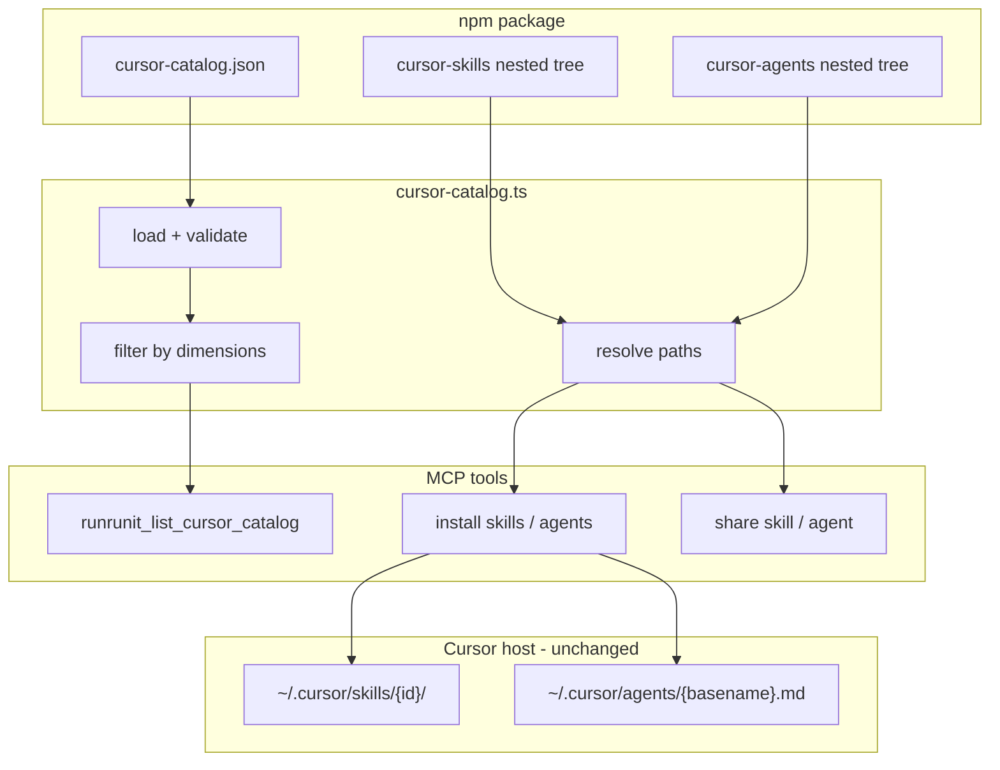

# ADR 0001: Cursor catalog and taxonomy for skills and agents

| Field    | Value                    |
| -------- | ------------------------ |
| Status   | Proposed                 |
| Date     | 2026-06-09               |
| Deciders | mcp-runrunit maintainers |

## Context

The `mcp-runrunit` npm package ships bundled Cursor skills (`cursor-skills/`) and agents (`cursor-agents/`) alongside MCP tools to install and share them. Today:

- **Flat layout.** Skills live as first-level subfolders of `cursor-skills/` (e.g. `cursor-skills/comentar-task-runrunit/`). Agents are mostly flat `.md` files under `cursor-agents/`, with limited support for one-level subfolders.
- **No machine-readable index.** The README lists skills and agents in manual tables. Those tables drift from disk (e.g. `performance-optimizer` is documented but absent; `security-auditor.md` exists but README references `security-reviewer`).
- **Shallow discovery.** `install-cursor-skills.ts` lists only the first level of `cursor-skills/`. Share paths assume `cursor-skills/{skill_name}/` and `cursor-agents/{basename}` at the repo root of each tree.
- **No category filters.** MCP install tools accept `skill_names` / `agent_names` by id only. Teams cannot express “install everything for Runrun.it” or “only security utilities” without naming each asset.

The package is growing by platform (Runrun.it, GitHub, Shopify) and by concern (evidence, quality, security). Maintainers and consumers need a stable public id, organized repo paths, and filterable discovery—without changing how Cursor stores assets locally (flat `~/.cursor/skills/{id}/` and `~/.cursor/agents/{basename}.md`).

## Decision

Adopt a **hybrid catalog + nested folders** model:

1. **`cursor-catalog.json`** at the package root is the source of truth for ids, repo paths, and taxonomy dimensions (`platform`, `technology`, `utility`).
2. **Nested physical layout** under `cursor-skills/` and `cursor-agents/` reflects a primary category axis (e.g. `platforms/runrunit/comentar-task-runrunit/`). Intermediate folders are organizational only—not installable entities.
3. **Public ids stay leaf names** (`comentar-task-runrunit`, `security-auditor`). MCP parameters `skill_name`, `agent_name`, and `skill_names` / `agent_names` remain unchanged.
4. **Install destination stays flat.** Copy resolves catalog/fs path → `~/.cursor/skills/{id}/` or `~/.cursor/agents/{destBasename}.md`.
5. **New module `src/application/cursor-catalog.ts`** loads and validates the catalog, resolves paths, filters by dimensions, and falls back to recursive filesystem discovery for orphan assets.
6. **Recursive discovery** replaces first-level-only listing in install and share code paths.
7. **New MCP tool `runrunit_list_cursor_catalog`** exposes the catalog (optional filters: `kind`, `platform`, `technology`, `utility`).
8. **Extended install tools** accept optional `categories` (AND across provided dimensions) in addition to explicit name lists.
9. **Share** writes to catalog paths (`cursor-skills/{entry.path}/`, `cursor-agents/{entry.path}`) instead of assuming flat roots.

Validation rules (enforced in catalog load / CI):

- Unique `id` per type (skills vs agents).
- `path` exists on disk; skills contain `SKILL.md`; agents are `.md` files.
- No `..` in paths; paths stay under `cursor-skills/` or `cursor-agents/`.
- Agent destination basenames unique (no collision when flattening to `~/.cursor/agents/`).

Orphan assets (on disk but not in catalog): installable with a warning in `dry_run` / skipped list; not blocking install-all.

## Alternatives considered

| Approach                           | Pros                                    | Cons                                                              | Outcome           |
| ---------------------------------- | --------------------------------------- | ----------------------------------------------------------------- | ----------------- |
| Catalog only, flat folders         | No Git path churn                       | Repo stays hard to navigate at scale; no physical grouping        | Rejected          |
| Nested folders only, no catalog    | Simple browsing                         | No multi-axis tags; one folder per skill when it spans categories | Rejected          |
| Separate npm packages per platform | Strong isolation                        | Publish/version overhead; fragmented install story                | Deferred (future) |
| **Catalog + nested folders**       | Organization + filters + stable MCP ids | One-time path migration in repo                                   | **Chosen**        |

## Consequences

### Positive

- Maintainers get a clear repo structure and a single file to update when adding assets.
- Teams can list and install by category (e.g. all `platform: runrunit` skills).
- Cursor agents and humans can discover assets via `runrunit_list_cursor_catalog` without reading the README.
- MCP API remains backward compatible for ids and install targets.

### Negative / trade-offs

- **Breaking change in repo paths** for skills/agents on GitHub (share PRs and deep links to folders change). Acceptable in a minor/major release with CHANGELOG notice.
- **Primary folder axis** when a skill has multiple categories: catalog holds all tags; physical path picks one primary axis (documented in PRD open questions).
- **Implementation cost:** new module, tests, migration of 8 skills and 7 agents, README/AGENTS updates.
- **Orphan policy** requires discipline: new assets should be added to the catalog; filesystem fallback is a safety net, not the norm.

### Neutral

- Package tarball size unchanged; share limits (512 KB/file, 2 MB/skill, 200 files) unchanged.
- Optional `cursor-catalog.schema.json` for JSON Schema validation in tests.
- Optional frontmatter on `SKILL.md` / agent files for description; catalog prevails on conflicts (consistency warnings only).

## Architecture sketch

Resolution order: **catalog first** → if `skill_names`/`agent_names` omitted and category filters present, resolve via catalog → else union of catalog entries and filesystem discovery.

## References

- Implementation plan: `.cursor/plans/skills_agents_taxonomy_8153206a.plan.md`
- Product requirements: `docs/PRD-cursor-catalog-taxonomy.md`
- Current install: `src/application/install-cursor-skills.ts`, `src/application/install-cursor-agents.ts`
- Current share paths: `src/application/share-cursor-paths.ts`, `src/application/share-cursor-github.ts`
- Workspace notes: `AGENTS.md` (local agents path, share via PR)
